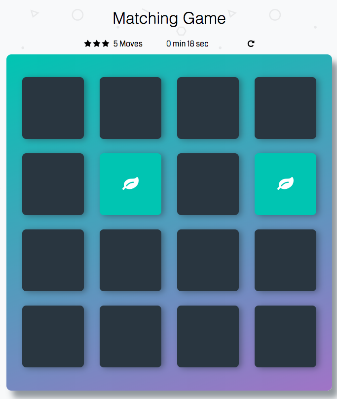
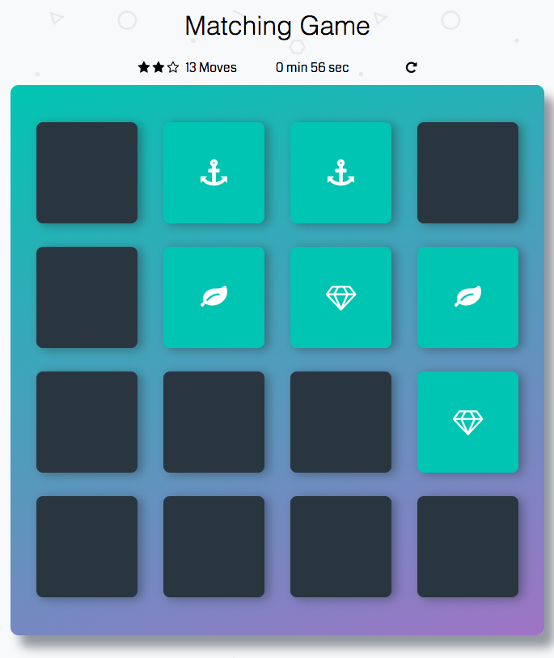
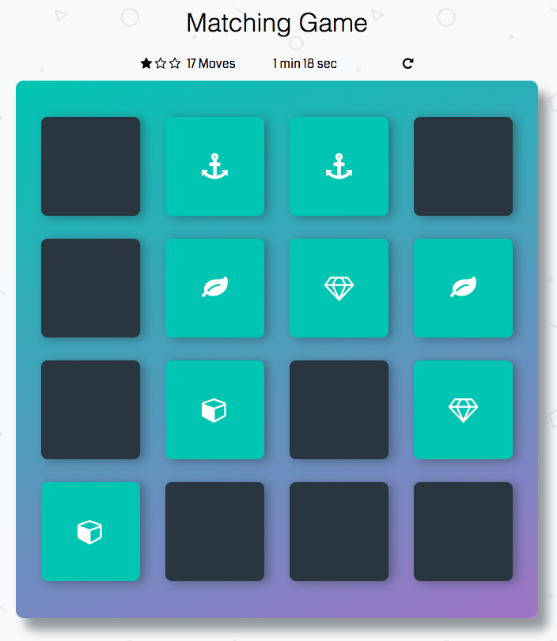
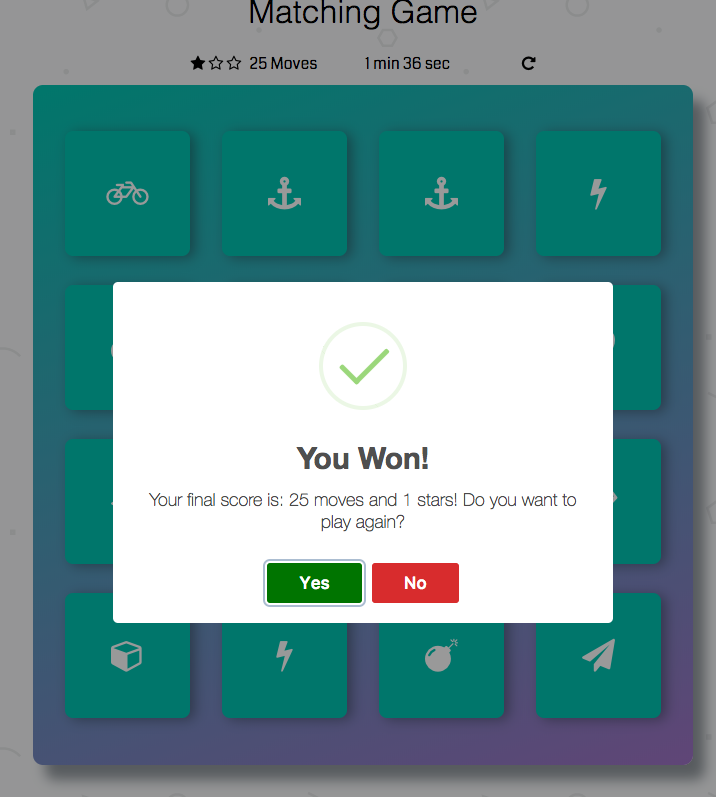
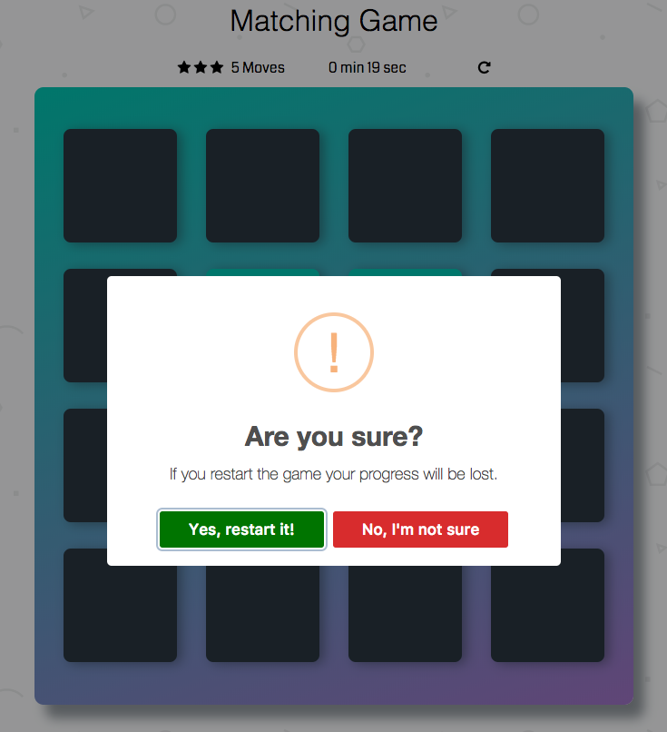

# Memory Game Project

This is a project from Udacity Front End Nanodegree, for studying purposes.

The Memory Game works basically the same way as any memory game: you try to match the pairs of images with as less moves as possible.

When the game starts, a timer will be displayed.
To start the game, just click on any card, then click in another one. If the cards match, they will stay opened and change their background color to green.

    

You start with 3 stars and, as you move, you can lose 1 or 2 stars. The less moves, the more stars.
When you reach 13 moves, your rating will change to 2 stars.

    

When you reach 17 moves, your rating will change to 1 star.

    

The game ends when all the pairs are matched.
When it's ended, your score will appear in your screen, then you can leave it or play again.

    

You can restart the game anytime you'd like - You just click the refresh icon and confirm if you really want to restar the game or continue in the previous game.

    

